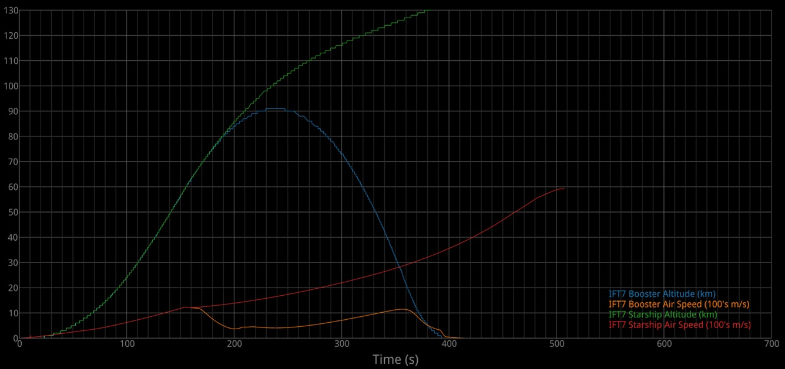

# ExtractTelemetry

ExtractTelemetry.cpp is a C++ tool that processes video frames, extracts telemetry data using OCR (Tesseract), and outputs the results in a structured format.

(Note: ExtractTelemetry.py was abandoned because it was too slow, but I checked it in anyway in case someone wants to try to improve it.)

## **Sample Plot** (after some manual cleanup of OCR mistakes)


## **Features**
- Extracts numerical telemetry values from video overlays
- Uses OpenCV for video frame processing
- Uses Tesseract OCR for text recognition
- Outputs telemetry data with confidence levels
- Supports logging and real-time data display

## **Installation**

### **Prerequisites**
Ensure you have the following dependencies installed:

- **C++ Compiler** (`g++` or `clang++`)
- **OpenCV** (for video processing)
- **Tesseract OCR** (for text extraction)
- **JSON for Modern C++** (for structured output)
- **CMake** (optional, for easier builds)

### **Installing Dependencies**
#### **Ubuntu / Debian**
```sh
sudo apt update
sudo apt install g++ cmake libopencv-dev tesseract-ocr libtesseract-dev libleptonica-dev
```

#### **MacOS (Homebrew)**
```sh
brew install cmake opencv tesseract
```

#### **Windows (vcpkg)**
```sh
vcpkg install opencv tesseract jsoncpp
```

## **Compilation**
### **Using g++**
```sh
g++ -o extractTelemetry.exe extractTelemetry.cpp `pkg-config --cflags --libs opencv4 jsoncpp` -llept -ltesseract -std=c++17
```

### **Using CMake**
1. **Create a `CMakeLists.txt` file**:
```cmake
cmake_minimum_required(VERSION 3.10)
project(ExtractTelemetry)

find_package(OpenCV REQUIRED)
find_package(Tesseract REQUIRED)

add_executable(extractTelemetry extractTelemetry.cpp)
target_link_libraries(extractTelemetry ${OpenCV_LIBS} tesseract jsoncpp)
```
2. **Build the project**:
```sh
mkdir build
cd build
cmake ..
make
```

### Downloading and Preparing Video to Process

Navigate to the twitter/X post that contains a video of the livestream that you want, right click on it, and select "Copy Video Address".

You will need to install the command line tool "yt-dlp" and then run it using the copied link.

```sh
 & 'C:\Program Files\yt-dlp\yt-dlp.exe' "https://x.com/i/broadcasts/1OwGWNYrzZVKQ"
```

You can install ffmpeg and use it to trim the video down to just the portion containing the telemetry. For example...

```sh
ffmpeg -ss 0:40:00.0 -to 0:48:35 -i '.\Starship''s Seventh Flight Test [1OwGWNYrzZVKQ].mp4' StarshipIFT7.mp4
````

## **Running the Program**
After compiling, run the program with:
```sh
./extractTelemetry path/to/video.mp4
```

### **Example Usage**
```sh
./extractTelemetry StarshipIFT7.mp4
```

This will extract telemetry data from `StarshipIFT7.mp4`.

You can also add the options "-ss" and "-to" (with timestamps) to extract telemetry from a portion of the video.

## **Output**
The program prints extracted telemetry values in real-time:
```
Extracted:   45  3200  12000   5000  15000 (Conf:  98%  95%  92%  89%  99%)
```
Additionally, it saves the results in a structured JavaScript file:
```js
export const StarshipIFT7 = [
{
	"boost_alt" : 0,
	"boost_alt_confidence" : 95.621681213378906,
	"boost_speed" : 117,
	"boost_speed_confidence" : 96.331283569335938,
	"frame" : 546,
	"ship_alt" : 0,
	"ship_alt_confidence" : 96.276702880859375,
	"ship_speed" : 117,
	"ship_speed_confidence" : 76.103164672851562,
	"timeInSec" : 11.06640625,
	"timer" : "T+00:00:11",
	"timer_confidence" : 86.704505920410156
}
,
{
	"boost_alt" : 0,
	"boost_alt_confidence" : 95.621681213378906,
	"boost_speed" : 117,
	"boost_speed_confidence" : 96.331283569335938,
	"frame" : 547,
	"ship_alt" : 0,
	"ship_alt_confidence" : 96.276702880859375,
	"ship_speed" : 117,
	"ship_speed_confidence" : 86.489372253417969,
	"timeInSec" : 11.099609375,
	"timer" : "T+00:00:11",
	"timer_confidence" : 86.199371337890625
}
];
```

## **Troubleshooting**
- **Error: `Could not open video file`**
  - Ensure the video file exists and the path is correct.
  - Try using an absolute file path.
  
- **Error: `Invalid resolution 0 dpi`**
  - Ensure `ocr.SetSourceResolution(300);` is set in the code.

- **OCR Accuracy Issues**
  - Try adjusting the thresholding parameters in OpenCV.
  - Use a higher-resolution input video.

## **Contributing**
Contributions are welcome! Feel free to open an issue or submit a pull request.

## **License**
This project is licensed under the MIT License.

